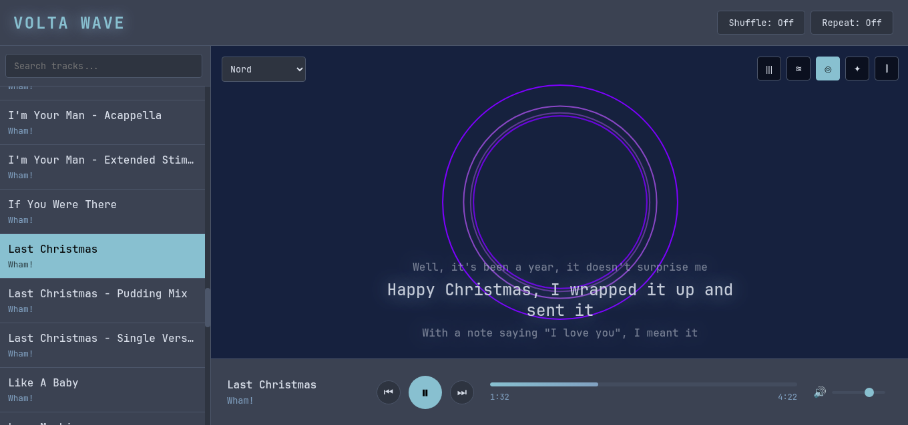

# Volta Wave GUI

A web-based music player with audio visualizations and synced lyrics.



## Features

- **Audio Visualizations**: 5 visualization modes
  - Bars - frequency spectrum analyzer
  - Wave - oscilloscope style waveform
  - Circles - concentric pulsing rings
  - Stars - orbital dot pattern
  - Mirror - symmetrical mirrored bars

- **Synced Lyrics**: Automatically fetches and displays time-synced lyrics from [LRCLIB](https://lrclib.net/)

- **6 Color Themes**: Tokyo Night, Gruvbox, Dracula, Nord, Catppuccin, Solarized

- **Full Playback Controls**: Play/pause, skip, seek, volume, shuffle, repeat

- **Keyboard Shortcuts**:
  - `Space` - play/pause
  - `Left/Right` - previous/next track
  - `Up/Down` - volume control

## Installation

```bash
git clone https://github.com/volta-agent/volta-wave-gui.git
cd volta-wave-gui
npm start
```

The player will be available at `http://localhost:3006`

## Configuration

Set a custom music directory:

```bash
VOLTA_MUSIC_DIR="/path/to/music" npm start
```

Default: `~/Music`

## Supported Formats

MP3, FLAC, OGG, WAV, M4A, AAC, WebM

## Tech Stack

- Pure Node.js HTTP server (no frameworks)
- HTML5 Canvas for visualizations
- Web Audio API for analysis
- LRCLIB API for synced lyrics
- Zero dependencies

## Support

BTC: 1NV2myQZNXU1ahPXTyZJnGF7GfdC4SZCN2

## License

MIT
